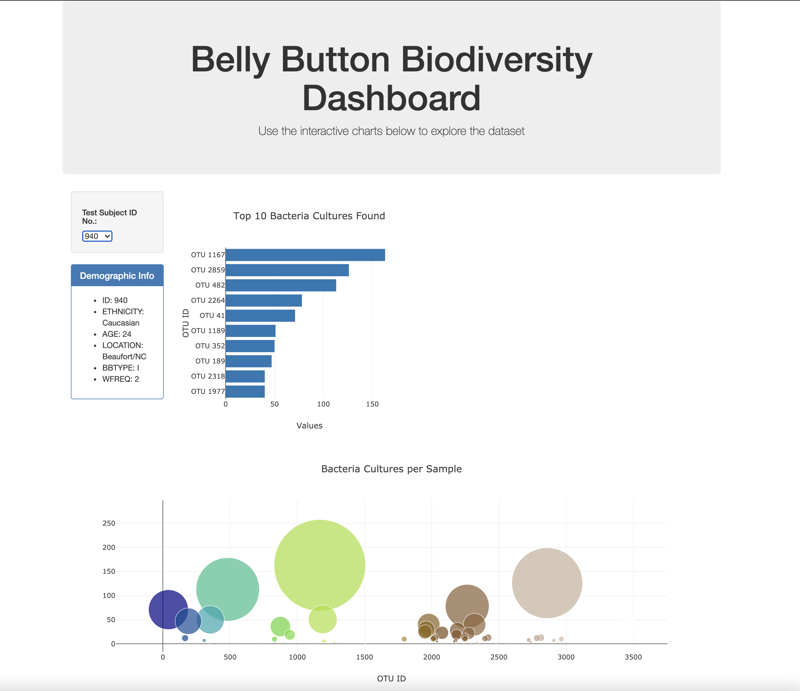

## Summary

Here we are exploring the [Belly Button Biodiversity dataset](http://robdunnlab.com/projects/belly-button-biodiversity/), which catalogs the microbes that colonize human navels. This dataset reveals tha ta smal handful of microbial specicies called operator taxonomic units (OTUs) were present in more than 70% of humans. We are loading in the dataset using JavaScript and using Plotly to create visualizations of the data.

## Scope

First we read in the [samples.json](data/samples.json) using the D3 library in order to create a few charts.

A dropdown is available in order to view the visualizations for a specific individual. The first chart is a horizontal barchart to display the top 10 OTUs found in an individual. The second chart is a bubble chart that display each sample. When rendered, the page should display these charts along with the individual's demographic information. 

Dashboard can be found by following the link for [https://carmelamonis.github.io/belly-button-biodiversity/](https://carmelamonis.github.io/belly-button-biodiversity/)
